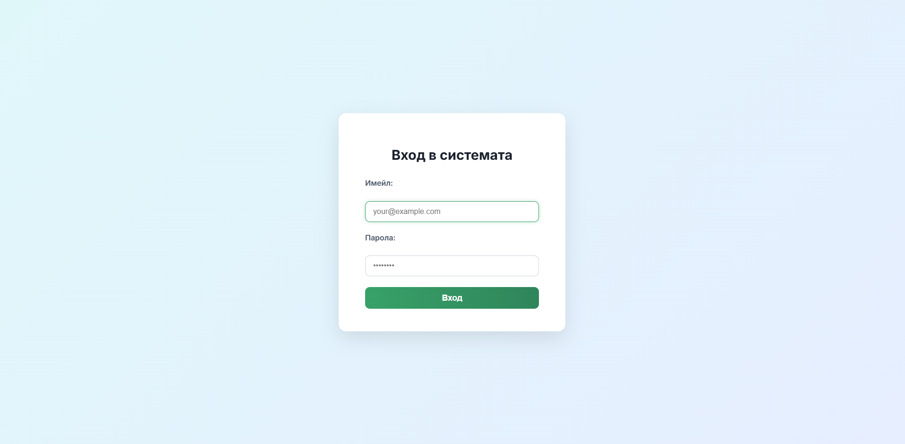
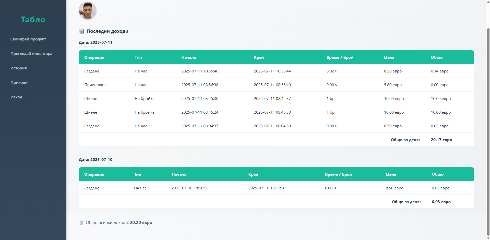
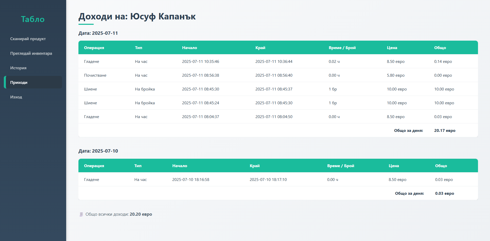
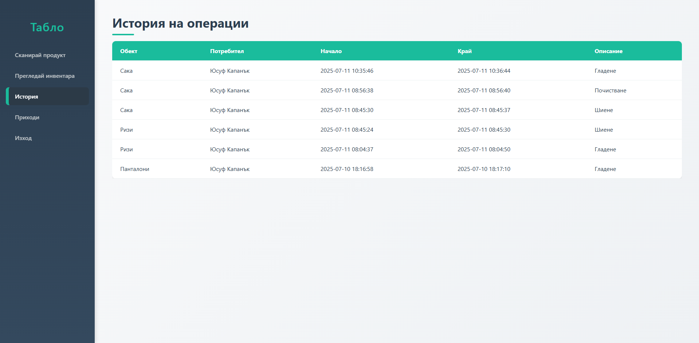
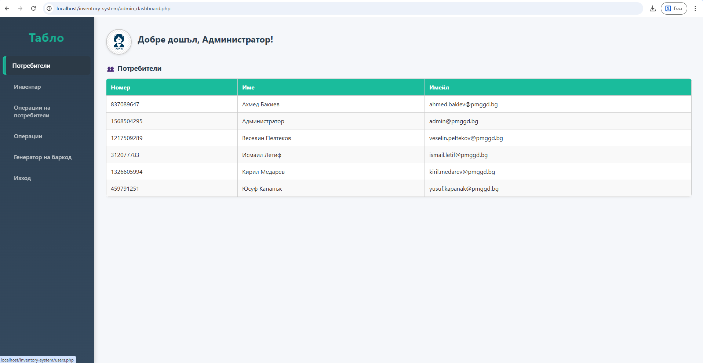
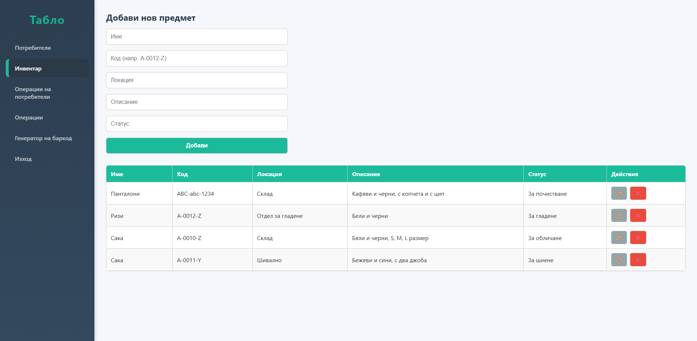
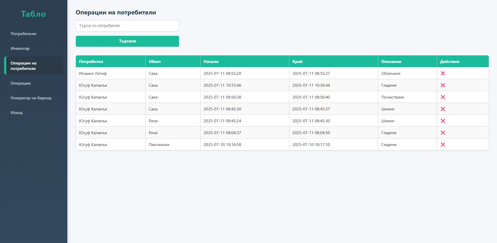
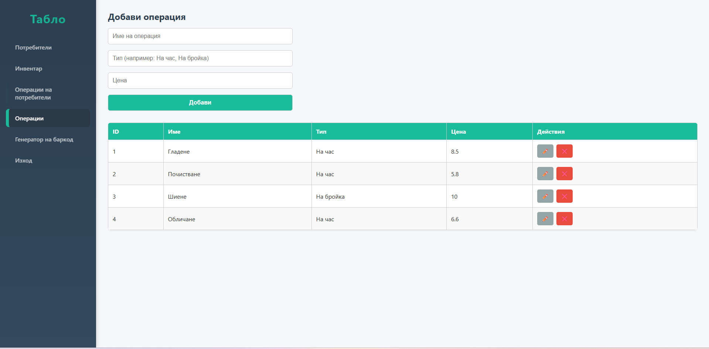

# Система за управление на производствени операции

Системата е уеб базирано приложение, специално разработено за управление на производствените операции и трудовия принос на служителите в шивашка фирма. Тя автоматизира процеса на регистриране на извършените дейности, съхранява историята на работната активност и изчислява заработените суми.

---

## 📖 Увод

В динамична производствена среда, където всеки работник извършва десетки до стотици операции дневно, е от критично значение тези дейности да се записват точно и систематично. Разработеното приложение предлага модерен, сигурен и лесен за употреба софтуерен инструмент, който замества хартиените записки и таблици.

**Основни предимства:**
* По-добра прозрачност между служители и ръководство.
* Намаляване на грешките и злоупотребите.
* Повишаване на ефективността в административната дейност.

---

## 🎯 Цел на приложението

* **Цифровизация:** Осигурява цифрова алтернатива на традиционните методи за отчитане.
* **Бързина и точност:** Позволява бързо въвеждане на извършените от всеки работник операции.
* **Автоматизация на заплащането:** Изчислява автоматично заработеното възнаграждение на база зададена цена за операция.
* **Архив и контрол:** Поддържа архив с възможност за търсене и филтриране.
* **Административен контрол:** Разделяне на ролите с разширени права за администраторите.

---

## ✨ Функционалности и Изгледи

### Начална страница и логин интерфейс
Осигурява лесен и сигурен екран за вход в системата. При успешен вход потребителят се пренасочва към съответното табло (потребителско или администраторско).

### Потребителски достъп и доходи
Обикновените потребители могат да проследяват собствените си операции, както и да виждат изчислените си доходи за деня или за избран период.

### Въвеждане на операции и Скениране
Въвеждането на операции става лесно, като системата поддържа и възможност за сканиране на QR/Баркод за бърза идентификация на продуктите.

### История и анализ на работата
Всеки потребител и администратор може да разглежда хронологичен списък с извършените операции, включващ дата, тип операция, брой и стойност.

### Административно табло
Централизиран изглед за администраторите, който позволява управление на потребители, инвентар, операции и преглед на цялостната база данни.

**Списък с потребители:**

**Управление на инвентара:**

**Операции на потребителите:**

**Добавяне и управление на типове операции (Ценоразпис):**

### Изчистване на операции
Системата предлага функционалност за изчистване на цялата история с един клик, което е изключително удобно при започване на нов отчетен период.

---

## 🛠 Използвани технологии

* **Бекенд:** PHP – за сървърната логика, обработка на данни, сесии и сигурност.
* **Фронтенд:** HTML5 / CSS3 – за структура и потребителски интерфейс.
* **База данни:** MySQL – за съхранение на потребители, инвентар, операции и заработки.
* **Интерактивност:** JavaScript – за валидиране на форми и подобряване на потребителското преживяване (напр. при сканиране на баркодове).

---

## 🔒 Сигурност

1. **Защита на достъпа:** Използват се PHP сесии за валидиране на всяка заявка и страница според ролята на потребителя.
2. **Хеширане на пароли:** Препоръчително е използването на вградените PHP функции (`password_hash` и `password_verify`) за сигурно съхранение.
3. **Защита на базата данни:** Използване на *Prepared Statements* (подготвени заявки) за предпазване от SQL инжекции.
4. **Ограничен достъп:** Строг ролеви модел (Admin / User), който не позволява на обикновени потребители да достъпват критични функционалности.

---

## 🚀 Бъдещо развитие

* Генериране на отчети в PDF и Excel формати.
* Визуални анализи чрез графики и диаграми (работна активност по дни, най-изпълнявани операции и др.).
* Интеграция с платежни системи и счетоводен софтуер за автоматизирани разплащания.
